# 微信小程序

## 小程序简介

### 1.小程序与普通网页开发的区别

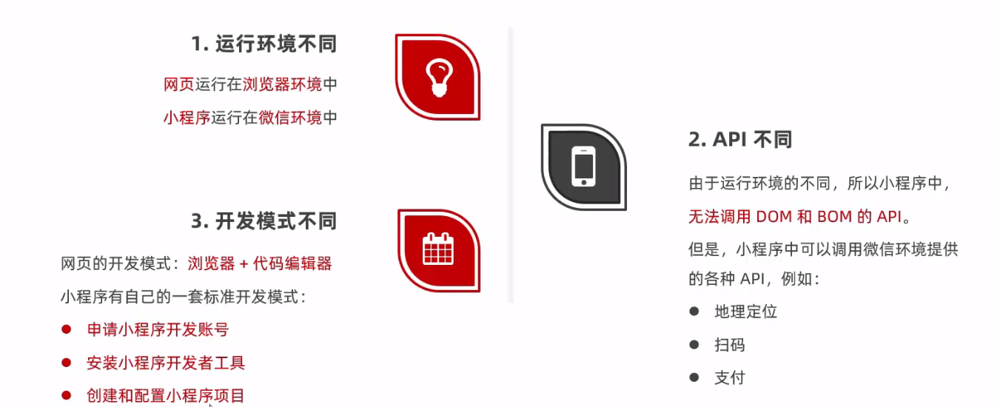

### 2.体验微信小程序

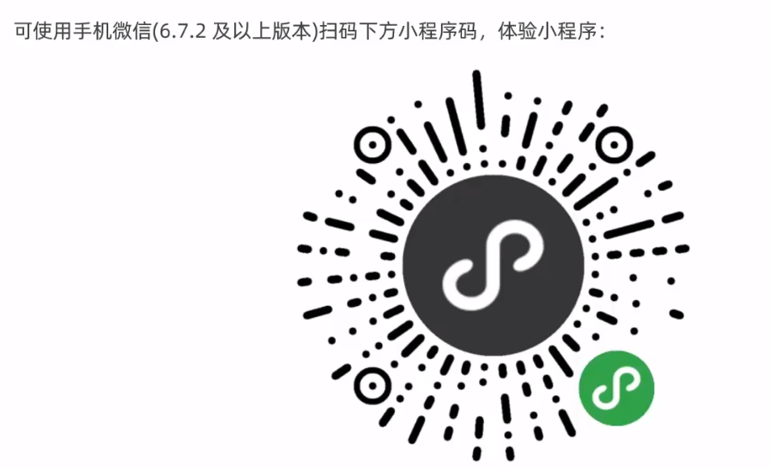

## 第一个小程序

### 1.注册开发账号

在[微信公众平台](https://mp.weixin.qq.com/)中注册开发账号

①

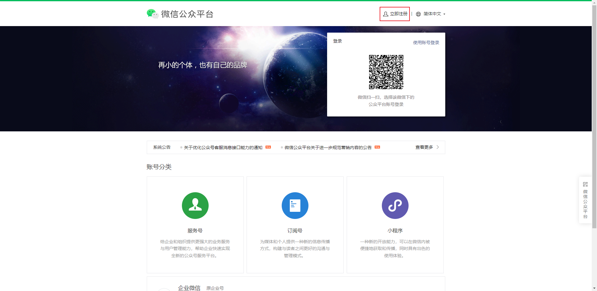

②

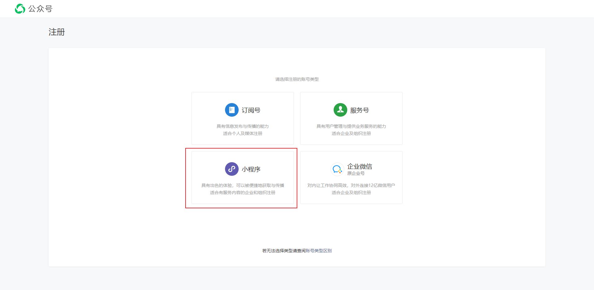

③

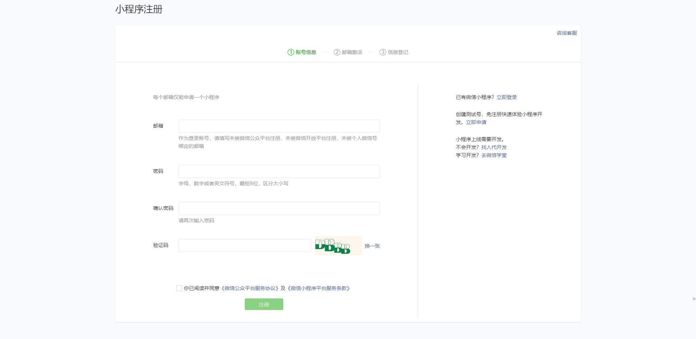

### 2.获取小程序的AppID

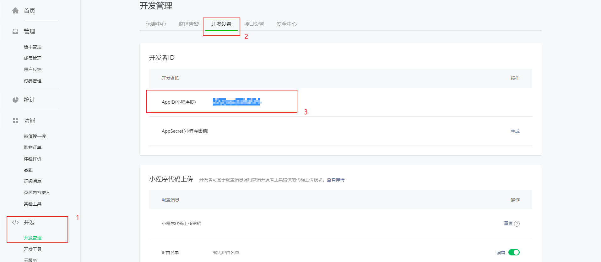

### 3.安装开发者工具

微信开发者工具是官方推荐使用的小程序开发工具，它提供的主要功能如下：

1.快速创建小程序项目

2.代码的查看和编辑

3.对小程序功能进行调试

4.小程序的预览和发布

[安装包下载](https://developers.weixin.qq.com/miniprogram/dev/devtools/download.html)

### 4.创建小程序项目

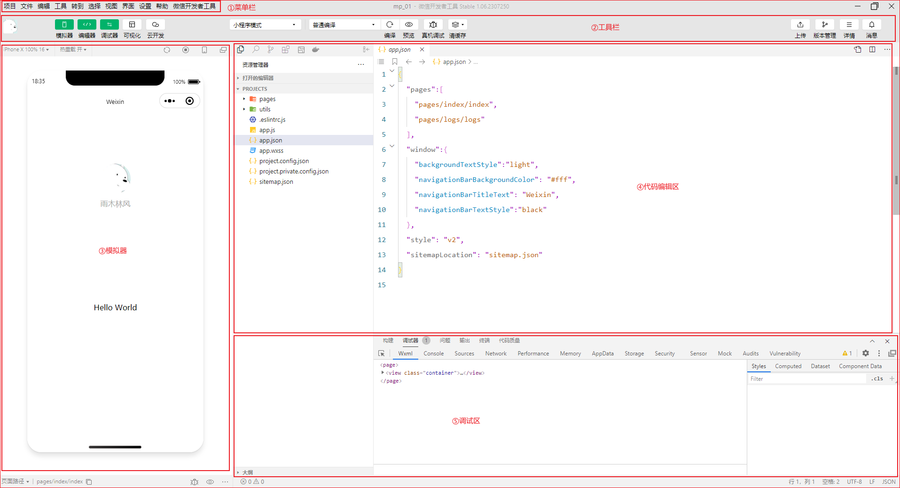

### 5.项目结构

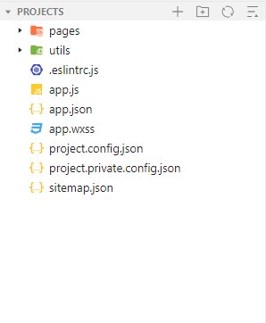

①**pages** 用来存放所有小程序的页面

②**utils** 用来存放工具性质的模块

③**app.js** 小程序项目的入口文件

④**app.json** 小程序的全局配置文件

⑤**app.wxss** 小程序的全局样式文件

⑥**project.config.json** 项目的配置文件

⑦**sitemap.json** 用来配置小程序及其页面是否允许被微信索引

### 6.小程序页面的组成部分

小程序官方建议把所有小程序的页面，都存放在**pages目录**中，以单独的文件夹存在，如图

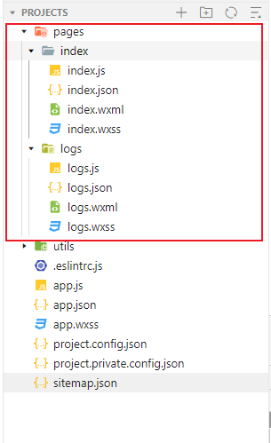

其中，每个页面由4个基本文件组成：

①.js文件：页面的脚步文件，存放页面的数据、事件处理函数等

②.json文件：当前页面的配置文件，配置窗口的外观、表现等

③.wxml文件：页面的模板结构文件

④.wxss文件：当前页面的样式表文件

### 7.JSON配置文件

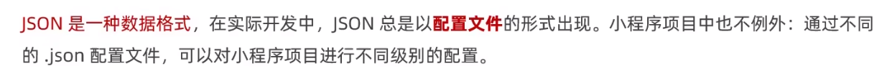

小程序项目中有4中json配置文件，分别是：

①项目根目录中的 app.json 配置文件

②项目根目录中的 project.config.json 配置文件

③项目根目录中的 sitemap.json 配置文件

④**每个页面文件夹中的 .json  配置文件** 

==app.json 文件==

app.json是当前小程序的**全局配置**，包括了小程序的

- 所有页面路径
- 窗口外观
- 界面表现
- 底部tab

等等

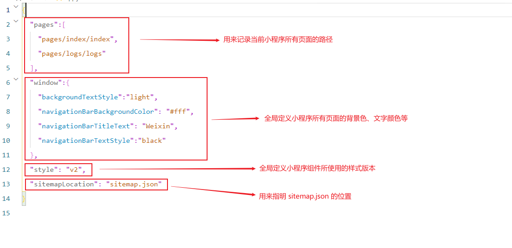

==project.config.json 文件==

project.config.json是项目配置文件，用来记录我们对小程序开发工具所做的个性化设置，例如：

- setting 中保存了 编译相关的配置
- projectname 中保存的是 项目名称
- appid 中保存的是 小程序的账号ID

==sitemap.json 文件==

微信现已开放小程序内搜索，效果类似于PC网页的SEO。

sitemap.json 文件用来配置小程序页面是否允许微信索引。

> 当开发者允许微信索引时，微信会通过爬虫的形式，为小程序的页面内容建立索引。
>
> 当用户的搜索关键字和页面的索引匹配成功时，小程序的页面将可能展示在搜索结果中。

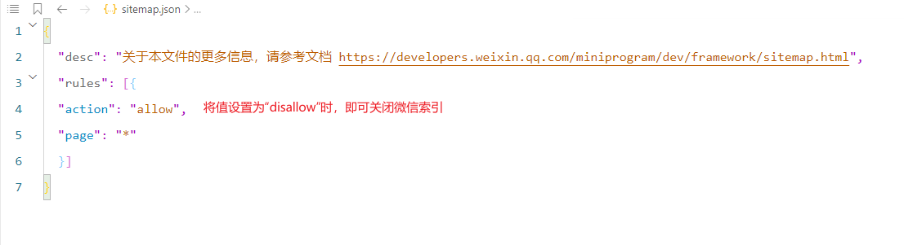

==页面的 .json 配置文件==

小程序中的每一个页面，可以使用 .json 文件来对本页面的窗口外观进行配置，**页面中的配置项会覆盖 app.json 的 window 中相同的配置项**

例如：将首页的导航栏背景色改为绿色

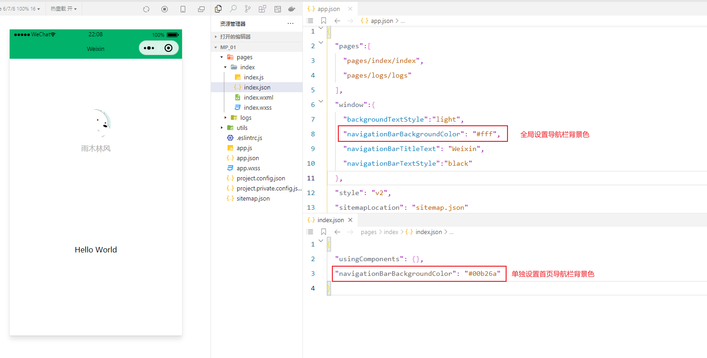

### 8.新建小程序页面

只需要在 app.json ==> pages 中新增页面的存放路径，开发工具即可帮我们自动创建对应的页面文件

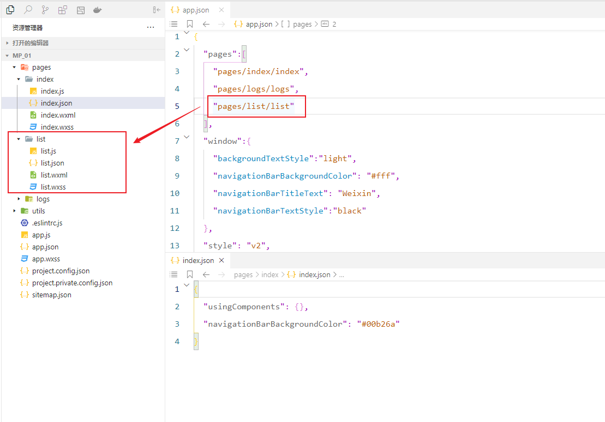

### 9.修改项目首页

只需要调整 app.json ==> pages 数组中页面路径的前后顺序，即可修改项目的首页。

小程序会把排在第一位的页面，当做项目首页进行渲染。

## WXML模板

### 1.什么是WXML？

​	WeiXin Markup Language 是小程序框架设计的一套标签语言，用来构建小程序页面的结构，其作用类似于HTML。

### 2.WXML 和 HTML 的区别

①标签名称不同

- HTML （div, span, img, a）
- WXML（view, text, image, navigator）

②属性节点不同

- \<a **href**="#">超链接\</a>
- \<navigator **url**="/pages/home/home">\</navigator>

③提供了类似于Vue中的模板语法

- 数据绑定
- 列表渲染
- 条件渲染

## WXSS样式

### 1.什么是WXSS

WeiXin Style Sheet 是一套样式语言，用于描述WXML的组件样式，类似于CSS。

### 2.WXSS 和 CSS 的区别

①新增了rpx尺寸单位

- CSS中需要手动进行像素单位换算，例如 rem
- WXSS在底层支持新的尺寸单位 rpx，在不同大小的屏幕上小程序会自动进行换算

②提供了全局的样式和局部的样式

- 项目根目录中的 app.wxss 会作用于所有小程序页面
- 局部页面的 .wxss 样式仅对当前页面生效

③WXSS仅支持部分CSS选择器

- .class 和 #id
- element
- 并集选择器、后代选择器
- ::after 和 ::before 等伪类选择器

## JS逻辑交互

一个项目仅仅提供界面展示是不够的，在小程序中，我们通过 .js 文件来处理用户的操作。

例如：响应用户的点击、获取用户的位置等等

==小程序中 .js 文件的分类==

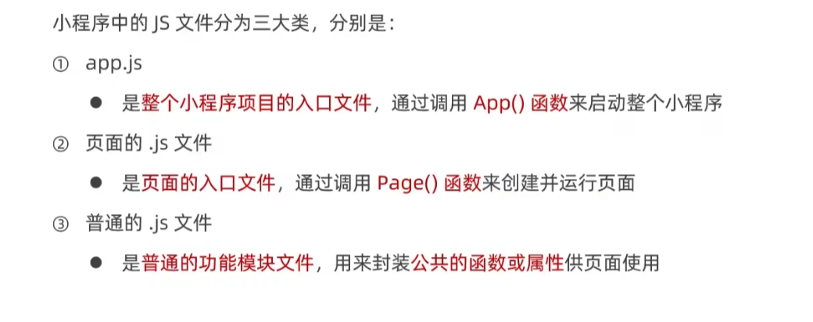

## 小程序的宿主环境