# 微信小程序


## 小程序简介

### 1.小程序与普通网页开发的区别


### 2.体验微信小程序


## 第一个小程序

### 1.注册开发账号

在[微信公众平台](https://mp.weixin.qq.com/)中注册开发账号

①


②


③


### 2.获取小程序的AppID


### 3.安装开发者工具

<span style="color:red;">微信开发者工具</span>是官方推荐使用的小程序开发工具，它提供的主要功能如下：

1.快速创建小程序项目

2.代码的查看和编辑

3.对小程序功能进行调试

4.小程序的预览和发布

[安装包下载](https://developers.weixin.qq.com/miniprogram/dev/devtools/download.html)


### 4.创建小程序项目


### 5.项目结构


<span style="color:red;">①**pages** 用来存放所有小程序的页面</span>

②**utils** 用来存放工具性质的模块

<span style="color:red;">③**app.js** 小程序项目的入口文件</span>

<span style="color:red;">④**app.json** 小程序的全局配置文件</span>

⑤**app.wxss** 小程序的全局样式文件

⑥**project.config.json** 项目的配置文件

⑦**sitemap.json** 用来配置小程序及其页面是否允许被微信索引


### 6.小程序页面的组成部分

小程序官方建议把所有小程序的页面，都存放在<span style="color:red;">**pages目录**</span>中，以<span style="color:red;">单独的文件夹</span>存在，如图


其中，每个页面<span style="color:red;">由4个基本文件</span>组成：

①<span style="color:red;">.js</span>文件：页面的脚步文件，存放页面的数据、事件处理函数等

②<span style="color:red;">.json</span>文件：当前页面的配置文件，配置窗口的外观、表现等

③<span style="color:red;">.wxml</span>文件：页面的模板结构文件

④<span style="color:red;">.wxss</span>文件：当前页面的样式表文件


### 7.JSON配置文件


小程序项目中有4中json配置文件，分别是：

①项目根目录中的 <span style="color:red;">app.json</span> 配置文件

②项目根目录中的 <span style="color:red;">project.config.json</span> 配置文件

③项目根目录中的 sitemap.json 配置文件

④<span style="color:red;">**每个页面文件夹中的 .json  配置文件** </span>


==app.json 文件==

app.json是当前小程序的<span style="color:red;">**全局配置**</span>，包括了小程序的

- 所有页面路径
- 窗口外观
- 界面表现
- 底部tab

等等


==project.config.json 文件==

project.config.json是项目配置文件，用来记录我们<span style="color:red;">对小程序开发工具所做的个性化设置</span>，例如：

- <span style="color:red;">setting</span> 中保存了 <span style="color:red;">编译相关的配置</span>
- <span style="color:red;">projectname</span> 中保存的是 <span style="color:red;">项目名称</span>
- <span style="color:red;">appid</span> 中保存的是 <span style="color:red;">小程序的账号ID</span>


==sitemap.json 文件==

微信现已开放<span style="color:red;">小程序内搜索</span>，效果类似于PC网页的SEO。

sitemap.json 文件用来<span style="color:red;">配置小程序页面是否允许微信索引</span>。

> 当开发者允许微信索引时，微信会通过爬虫的形式，为小程序的页面内容建立索引。
>
> 当用户的搜索关键字和页面的索引匹配成功时，小程序的页面将可能展示在搜索结果中。


==页面的 .json 配置文件==

小程序中的每一个页面，可以使用 .json 文件来<span style="color:red;">对本页面的窗口外观进行配置</span>，<span style="color:red;">**页面中的配置项会覆盖 app.json 的 window 中相同的配置项**</span>

例如：将首页的导航栏背景色改为绿色


### 8.新建小程序页面

只需要在 <span style="color:red;">app.json</span> ==> <span style="color:red;">pages</span> 中新增页面的存放路径，开发工具即可帮我们自动创建对应的页面文件


### 9.修改项目首页

只需要调整 <span style="color:red;">app.json</span> ==> <span style="color:red;">pages</span> 数组中页面路径的前后顺序，即可修改项目的首页。

小程序会把排在第一位的页面，当做项目首页进行渲染。


## WXML模板

### 1.什么是WXML？

​	WeiXin Markup Language 是小程序框架设计的一套<span style="color:red;">标签语言</span>，<span style="color:red;">用来构建小程序页面的结构</span>，其作用类似于HTML。


### 2.WXML 和 HTML 的区别

①<span style="color:red;">标签名称不同</span>

- HTML （div, span, img, a）
- WXML（view, text, image, navigator）

②<span style="color:red;">属性节点不同</span>

- \<a **href**="#">超链接\</a>
- \<navigator **url**="/pages/home/home">\</navigator>

③<span style="color:red;">提供了类似于Vue中的模板语法</span>

- 数据绑定
- 列表渲染
- 条件渲染


## WXSS样式

### 1.什么是WXSS

WeiXin Style Sheet 是一套样式语言，用于描述WXML的组件样式，类似于CSS。


### 2.WXSS 和 CSS 的区别

①<span style="color:red;">新增了rpx尺寸单位</span>

- CSS中需要手动进行像素单位换算，例如 rem
- WXSS在底层支持新的尺寸单位 rpx，在不同大小的屏幕上小程序会自动进行换算

②<span style="color:red;">提供了全局的样式和局部的样式</span>

- 项目根目录中的 app.wxss 会作用于所有小程序页面
- 局部页面的 .wxss 样式仅对当前页面生效

③<span style="color:red;">WXSS仅支持部分CSS选择器</span>

- .class 和 #id
- element
- 并集选择器、后代选择器
- ::after 和 ::before 等伪类选择器


## JS逻辑交互

一个项目仅仅提供界面展示是不够的，在小程序中，我们通过 .js 文件来处理用户的操作。

例如：响应用户的点击、获取用户的位置等等


==小程序中 .js 文件的分类==


## 小程序的宿主环境

Host Environment 指的是<span style="color:red;">程序运行所**必须的依赖环境**</span>。例如：

Android系统 和 iOS系统 是两个不同的宿主环境。安卓版的微信App是不能在iOS环境下运行的，所以Android是安卓软件的**宿主环境**，<span style="color:red;">脱离了宿主环境的软件是没有任何意义的！</span>


<span style="color:red;">**手机微信**是小程序的宿主环境</span>，如图↑

小程序借助宿主环境提供的能力，可以完成许多普通网页无法完成的功能。例如：微信扫码、微信支付、微信登录、地理定位、etc...


### 包含内容

小程序的宿主环境包含以下内容：

- 通信模型
- 运行机制
- 组件
- API


### 通信模型

小程序中通信的主体是 <span style="color:red;">渲染层</span> 和 <span style="color:red;">逻辑层</span>，其中

- WXML模板 和 WXSS样式 工作在 <span style="color:red;">渲染层</span>

- JS脚本 工作在 <span style="color:red;">逻辑层</span>

小程序中的通信模型分为两部分：

① <span style="color:red;">渲染层</span> 和 <span style="color:red;">逻辑层</span> 之间的通信，由微信客户端进行转发

② <span style="color:red;">逻辑层</span> 和 <span style="color:red;">第三方服务器</span> 之间的通信，由微信客户端进行转发


### 运行机制

小程序的启动过程


页面的渲染过程


### 组件

小程序中的组件也是由宿主环境提供的。

开发者可以基于组件快速搭建出漂亮的页面结构。官方把小程序的组件分为了9大类

<span style="color:red;">1.视图容器</span>

<span style="color:red;">2.基础内容</span>

<span style="color:red;">3.表单组件</span>

<span style="color:red;">4.导航组件</span>

5.媒体组件

6.map地图组件

7.canvas画布组件

8.开放能力

9.无障碍访问


#### <span style="color:red;">1.视图容器</span>

##### view

- 普通的视图区域
- 类似于div
- 常用来实现页面的布局效果

==案例：list页面==

`list.wxml`

```xml
<!--pages/list/list.wxml-->
<view class="container1">
  <view>A</view>
  <view>B</view>
  <view>C</view>
</view>
```

`list.wxss`

```css
/* pages/list/list.wxss */
.container1 view {
  width: 100px;
  height: 100px;
  text-align: center;
  line-height: 100px;
}

.container1 view:nth-child(1) {
    background-color: lightgreen;
}

.container1 view:nth-child(2) {
    background-color: lightskyblue;
}

.container1 view:nth-child(3) {
    background-color: lightpink;
}

.container1 {
  display: flex;
  justify-content: space-around;
}
```

案例效果


##### scroll-view

- 可滚动的视图区域
- 常用来实现滚动列表的效果

==案例：list页面==

`list.wxml`

```xml
<scroll-view class="container2" scroll-y>
    <view>A</view>
    <view>B</view>
    <view>C</view>
</scroll-view>
```

`list.wxss`

```css
.container2 view {
    width: 100px;
    height: 100px;
    text-align: center;
    line-height: 100px;
}

.container2 view:nth-child(1) {
    background-color: lightgreen;
}

.container2 view:nth-child(2) {
    background-color: lightskyblue;
}

.container2 view:nth-child(3) {
    background-color: lightpink;
}

.container2 {
    margin-top: 20px;
    margin-left: 14px;
    border: 1px solid red;
    /* 给 scroll-view固定高度*/
    height: 120px;
    width: 100px;
}
```

案例效果


##### swiper和swiper-item

- 轮播图容器组件 和 轮播图item组件

<span style="color:red;">swiper组件的常用属性</span>


==案例：list页面==

`list.wxml`

```xml
<swiper class="swiper-container" indicator-dots>
    <swiper-item>
        <view class="item">A</view>
    </swiper-item>
    <swiper-item>
        <view class="item">B</view>
    </swiper-item>
    <swiper-item>
        <view class="item">C</view>
    </swiper-item>
</swiper>
```

`list.wxss`

```css
/* 轮播图的样式 */
.swiper-container {
    margin-top: 20px;
    height: 150px;
}

.item {
    height: 100%;
    line-height: 150px;
    text-align: center;
}

swiper-item:nth-child(1) .item {
    background-color: lightgreen;
}

swiper-item:nth-child(2) .item {
    background-color: lightskyblue;
}

swiper-item:nth-child(3) .item {
    background-color: lightpink;
}
```

案例效果


#### <span style="color:red;">2.基础内容</span>

##### text

- 文本组件
- 类似于span

基本使用：通过text组件的<span style="color:red;">selectable</span>属性，实现**长按选中文本内容**的效果。*其他组件均不支持此效果*

```xml
<view style="margin-top: 20px;">
    手机号支持长按选中效果：
    <text selectable>123456789</text>
</view>
```


##### rich-text

- 富文本组件
- 支持把HTML字符串渲染为WXML结构

基本使用：通过rich-text组件的nodes属性节点，<span style="color:red;">把HTML字符串渲染成对应的UI结构</span>

```xml
<rich-text style="margin-top: 20px;" nodes="<h1 style='color:red;'>标题</h1>"></rich-text>
```


#### 3.其他常用组件

##### button

- 按钮组件
- 功能比HTML中的button按钮丰富
- 通过open-type属性可以调用微信提供的各种功能（客服、转发、获取用户授权、获取用户信息等）

基本使用：通过**type**指定按钮类型、通过**size**指定按钮尺寸、通过**plain**镂空按钮

```xml
<!--pages/button/button.wxml-->
<!-- 通过type属性指定按钮颜色类型 -->
<view>===========type属性============</view>
<button>默认按钮</button>
<button type="primary">主色调按钮</button>
<button type="warn">警告按钮</button>

<!-- 通过size属性指定按钮颜色尺寸 -->
<view>============size属性============</view>
<button size="default">默认按钮</button>
<button size="mini">小尺寸按钮</button>

<!-- 通过plain属性镂空按钮 -->
<view>===========plain属性=============</view>
<button plain type="primary">镂空按钮</button>
<button plain type="warn">镂空按钮</button>
```


##### image

- 图片组件
- image组件默认宽度约为300px、高度约为240px

基本使用：

```xml
<!--pages/images/images.wxml-->
<image/>
<image src="/images/1.png" mode="aspectFit"/>
```

image组件的**mode**属性用来指定图片的**裁剪**和**缩放**模式，常用的mode属性值如下


##### navigator

- 页面导航组件
- 类似于a链接


### API

<span style="color:red;">小程序中的API是由宿主环境提供的</span>，通过这些丰富的小程序API，开发者可以方便的调用微信提供的能力，

例如：获取用户信息、本地存储、支付功能等。

小程序的API分为3大类：

1.事件监听API

- 特点：以on开头，用来监听某些事件的触发
- 举例：wx.onWindowResize(function callback) 监听窗口尺寸变化的事件

2.同步API

- 特点1：以Sync结尾的API都是同步API
- 特点2：同步API的执行结果，可以通过函数返回值直接获取，如果执行出错会抛出异常
- 举例：wx.setStorageSync('key', 'value')向本地存储中写入内容

3.异步API

- 特点：类似于jQuery中的$.ajax(options)函数，需要通过success、fail、complete接收调用的结果
- 举例：wx.request()发起网络数据请求，通过success回调函数接收数据


## 协同工作和发布

### 1.协同工作

权限管理需求


项目成员的组织结构


小程序的开发流程


### 2.小程序的成员管理

小程序的成员管理体现在<span style="color:red;">管理员</span>对小程序<span style="color:red;">项目成员</span>及<span style="color:red;">体验成员</span>的管理：


项目成员

- 表示参与小程序开发、运营的成员
- 可登录小程序管理后台
- 管理员可以添加、删除项目成员，并设置项目成员的角色

体验成员

- 表示参与小程序内测体验的成员
- 可使用体验版小程序，但不属于项目成员
- 管理员及项目成员均可添加、 删除体验成员


==开发者的权限说明==

①开发者权限：可使用小程序开发者工具及对小程序的功能进行代码开发

②体验者权限：可使用体验版小程序

③登录权限：可登录小程序管理后台，无需管理员确认

④开发设置：设置小程序服务器域名、消息推送及扫描普通链接二维码打开小程序

⑤腾讯云管理：云开发相关设置


==添加 项目成员 和 体验成员==


### 3.小程序的版本


### 4.发布上线

一个小程序的发布上线，一般要经过<span style="color:red;">上传代码</span>-><span style="color:red;">提交审核</span>-><span style="color:red;">发布</span>这三个步骤。

1.小程序上传代码


2.在后台查看上传之后的版本


3.提交审核


4.发布


5.基于小程序码进行推广


### 5.运营数据

1.查看小程序运营数据的两种方式


## 模板与配置

### 1.WXML模板语法

#### 数据绑定

基本原则：

①在data中定义数据：在页面对应的js文件中，把数据定义到data对象中即可

②在wxml中使用数据：<span style="color:red;">Mustache语法</span>（双大括号）


Mustache语法的应用场景：

- 绑定内容
- 绑定属性
- 运算（三元运算、算术运算等）

==案例：index页面==

`index.js`

```js
// index.js
Page({
    data: {
        info: 'hello world',
        imgSrc: 'https://www.itheima.com/images/logo.png',
        randomNum1: Math.random() * 10,
        randomNum2: Math.random().toFixed(2)
    },

    onLoad() {
    },

    getUserProfile(e) {
    },

    getUserInfo(e) {
    }
})
```

`index.wxml`

```xml
<!--index.wxml-->
<!-- 动态绑定内容 -->
<view>{{info}}</view>

<!-- 动态绑定属性 -->
<image src="{{imgSrc}}" mode="widthFix"/>

<!-- 三元运算 -->
<view>{{randomNum1 >= 5 ? '5以上' : '5以下'}}</view>

<!-- 算术运算 -->
<view>{{randomNum2 * 100}}</view>
```


#### 事件绑定

##### 1.什么是事件

事件是<span style="color:red;">渲染层到逻辑层的通讯方式</span>，通过事件可以将用户在渲染层产生的行为，反馈到逻辑层进行业务的处理。


##### 2.小程序中常用的事件


##### 3.事件对象的属性列表

当事件回调触发的时候，会收到一个事件对象event，它的详细属性如下：


##### 4.target 和 currentTarget 的区别★

target 是 <span style="color:red;">触发该事件的源头组件</span>，而 currentTarget 则是 <span style="color:red;">当前事件所绑定的组件</span>。举例如下：


点击内部的按钮时，点击事件以<span style="color:red;">冒泡</span>的方式向外扩散，也会触发外层的 view 的 tap 事件处理函数。

此时，对于外层的 view 来说：

- e.target 指向的是触发事件的源头组件，因此，e.target 是内部的按钮组件
- e.currentTarget 指向的是当前正在触发事件的那个组件，因此，e.currentTarget 是当前的 view 组件


##### 5.bind:tap 的语法格式

在小程序中，不存在HTML的onclick鼠标点击事件，而是通过 <span style="color:red;">tap</span> 事件来响应用户的触摸行为。

①通过 bind:tap，可以为组件绑定 tap 触摸事件

②在 页面.js 文件中定义对应的事件处理函数，事件参数通过形参event（一般简写成 e）来接收

==案例：index页面==

`index.js`

```js
// index.js

/* 
    页面的初始数据
*/
Page({
    data: {
        info: 'hello world',
        imgSrc: 'xxxxx',
        randomNum1: Math.random() * 10,
        randomNum2: Math.random().toFixed(2)
    },

    // 定义按钮的事件处理函数
    outerHandler(e) {
        console.log(e);
        console.log(e.target);
        console.log(e.currentTarget);
    }
})
```

`index.wxml`

```xml
<!-- target和currentTarget的区别 -->
<view class="outer-view" bind:tap="outerHandler">
    <button type="primary">按钮</button>
</view>
```


##### 6.在事件处理函数中为data中的数据赋值

通过调用 <span style="color:red;">this.setData(dataObj)</span> 方法，可以给页面 data 中的数据重新赋值

==案例：index页面==

`index.wxml`

```xml
<!-- 在事件处理函数中为data中的数据赋值 -->
<text>{{count}}</text>
<button type="primary" bind:tap="countChange">+</button>
```

`index.js`

```js
Page({
    data: {
        count: 0
    },

    // 定义按钮的事件处理函数
    countChange(e) {
        this.setData({
            //注意！此处不能用 ++，会导致按钮失效
            count: this.data.count + 1
        })
    })
```


#### 事件传参与数据同步

##### 7.事件传参

<span style="color:red;">**ERROR**：</span>

小程序中的事件传参比较特殊，<span style="color:red;">不能在绑定事件的同时为事件处理函数传递参数</span>。例如，下面的代码将不能正常工作

```xml
<button type="primary" bind:tap="btnHandler(123)">事件传参</button>
```

因为小程序会把 bind:tap 的属性值，统一当作事件名称来处理，相当于要调用一个名称为 <span style="color:red;">btnHandler(123)</span> 的事件处理函数。


<span style="color:lightgreen;">**RIGHT**：</span>

可以为组件提供 <span style="color:red;">data-*</span> 自定义属性传参，其中 <span style="color:red;">\* 代表的是参数的名字</span>，示例代码如下：

```xml
<button bind:tap="btnHandler" data-info="{{2}}">事件传参</button>
```

最终

- <span style="color:red;">info</span> 会被解析为 <span style="color:red;">参数的名字</span>
- 数值 <span style="color:red;">2</span> 会被解析为 <span style="color:red;">参数的值</span>

在事件处理函数中，通过 <span style="color:red;">event.target.dataset.参数名</span> 即可获取到 <span style="color:red;">具体参数的值</span>，示例代码如下：

```js
btnHandler(event) {
    // dataset 是一个对象，包含了所有通过 data-* 传递过来的参数项
    console.log(event.target.dataset)
    // 通过 dataset 可以访问到具体参数的值
    console.log(event.target.dataset.info)
}
```


##### 8.bindinput 的语法格式

在小程序中，通过 <span style="color:red;">input 事件</span> 来响应文本框的输入事件，语法格式如下：

①通过 bindinput，可以为文本框绑定输入事件

②在页面的 .js 文件中定义事件处理函数

==案例：index页面==

`index.js`

```js
inputHandler(e) {
    console.log(e.detail.value);
}
```

`index.wxml`

```xml
<input type="text" bindinput="inputHandler"/>
```


##### 9.数据同步

实现文本框和data之间的数据同步：

①定义数据

②渲染结构

③美化样式

④绑定 input 事件处理函数

==案例：index页面==

`index.js`

```js
Page({
    data: {
        msg: '你好'
    },

    // 定义按钮的事件处理函数

    inputHandler2(e) {
        this.setData({
            msg: e.detail.value
        })
    }
})
```

`index.wxml`

```xml
<!-- 数据同步 -->
<input value="{{msg}}" type="text" bindinput="inputHandler2"/>
```


#### 条件渲染

##### wx:if

在小程序中，使用 <span style="color:red;">wx:if=""</span> 来判断是否需要渲染该代码块：

```xml
<view wx:if="{{condition}}"> True </view>
```

也可以用 <span style="color:red;">wx:elif</span> 和 <span style="color:red;">wx:else</span> 来添加else判断：

```xml
<view wx:if="{{type === 1}}"> 男 </view>
<view wx:elif="{{type === 2}}"> 女 </view>
<view wx:else> 保密 </view>
```


##### 结合\<block>使用wx:if

如果要<span style="color:red;">一次性控制多个组件的展示与隐藏</span>，可以使用一个 <span style="color:red;">\<block>\</block></span> 标签将多个组件包装起来，

并在 \<block>标签上使用 wx:if 控制属性，实例如下：

```xml
<block wx:if="{{true}}">
	<view> view1 </view>
   	<view> view2 </view>
</block>
```

<span style="color:red;">**注意：**</span> \<block><span style="color:red;">并不是一个组件</span>，它只是一个包裹性质的容器，<span style="color:red;">不会在页面中做任何渲染。</span>


##### hidden

在小程序中，直接使用 <span style="color:red;">hidden=""</span> 也能控制元素的显示与隐藏：

```xml
<view hidden="{{condition}}"> 条件为 true 隐藏，条件为 false 显示</view>
```


##### wx:if 与 hidden 对比

①运行方式不同

- wx:if 以<span style="color:red;">动态创建和移除元素</span>的方式，控制元素的展示与隐藏
- hidden 以<span style="color:red;">切换样式</span>的方式(display: none/block;)，控制元素的显示与隐藏

②使用建议

- <span style="color:red;">频繁切换</span>时，建议使用 <span style="color:red;">hidden</span>
- <span style="color:red;">控制条件复杂</span>时，建议使用 <span style="color:red;">wx:if</span> 搭配 wx:elif、wx:else进行展示与隐藏的切换


#### 列表渲染

##### wx:for

通过 wx:for 可以根据指定的数组，循环渲染重复的组件结构，语法示例如下：

```xml
<view wx:for="{{array}}">
	索引是：{{index}}, 当前项是：{{item}} 
</view>
```

默认情况下，当前循环的<span style="color:red;">索引</span>用 <span style="color:red;">index</span> 表示，<span style="color:red;">当前循环项</span>用 <span style="color:red;">item</span> 表示。


\* *手动指定 索引 和 当前项 多变量名*

- 使用 <span style="color:red;">wx:for-index</span> 可以指定<span style="color:red;">当前循环项的索引</span>的变量名
- 使用 <span style="color:red;">wx:for-item</span> 可以指定<span style="color:red;">当前项</span>的变量名

示例代码如下：

```xml
<view wx:for="{{array}}" wx:for-index="idx" wx:for-item="itemName">
	索引是：{{idx}}, 当前项是：{{itemName}} 
</view>
```


##### wx:key

类似于 Vue 列表渲染中的 <span style="color:red;">**:key**</span>，小程序在实现列表渲染时，也建议为渲染出来的列表项指定唯一的 key 值，从而<span style="color:red;">提高渲染的效率</span>，示例代码如下：

```js
data: {
    userList: [
        {id: 1, name: '小红'},
        {id: 2, name: '小黄'},
        {id: 3, name: '小白'},
    ]
}
```

指定 key 时，不需要用Mustache语法！！

```xml
<view wx:for="{{userList}}" wx:key="id">{{item.name}}</view>
```


### 2.WXSS模板样式

WXSS 与 CSS 的关系：

WXSS 具有 CSS 大部分特性，同时，WXSS 还对 CSS 进行了扩充以及修改，以适应微信小程序的开发。

WXSS 扩展的特性有：

- <span style="color:red;">rpx</span> 尺寸单位
- <span style="color:red;">@import</span> 样式导入


#### rpx单位

<span style="color:red;">rpx</span>（responsive pixel）是微信小程序独有的，用来<span style="color:red;">解决屏幕适配的尺寸单位。</span>

实现原理：鉴于不同设备屏幕的大小不同，为了实现屏幕的自动适配，rpx把所有设备的屏幕，在宽度上<span style="color:red;">等分为750份</span>（即：<span style="color:red;">当前屏幕的总宽度为750rpx</span>）。

- 在<span style="color:red;">较小</span>的设备上，<span style="color:red;">1rpx所代表的宽度较小</span>
- 在<span style="color:red;">较大</span>的设备上，<span style="color:red;">1rpx所代表的宽度较大</span>

小程序在不同设备上运行的时候，会自动把rpx的样式单位换算成对应的像素单位来渲染，从而实现屏幕适配。


#### 样式导入

使用 WXSS 提供的 <span style="color:red;">@import</span> 语法，可以导入外联的样式表。

语法格式：

<span style="color:red;">@import</span> 后跟需要导入的外联样式表的<span style="color:red;">相对路径</span>，用 <span style="color:red;">;</span> 表示语句结束。示例如下：

```css
/** common.wxss **/
.small-p {
    padding: 5px;
}
```


```css
/** app.wxss **/
@import "common.wxss";
.middle-p {
    padding: 15px;
}
```


#### 全局样式

定义在 <span style="color:red;">app.wxss</span> 中的样式称为<span style="color:red;">全局样式</span>，作用于每一个页面。


#### 局部样式

在<span style="color:red;">页面的.wxss</span>文件中定义的样式为<span style="color:red;">局部样式</span>，只作用于当前页面。

注意：

①当局部样式和全局样式冲突时，根据<span style="color:red;">就近原则</span>，局部样式会<span style="color:red;">覆盖</span>全局样式

②当局部样式的<span style="color:red;">权重大于或等于</span>全局样式的权重时，才会覆盖全局的样式


### 3.全局配置

小程序根目录下的 <span style="color:red;">app.json</span> 文件是小程序的<span style="color:red;">全局配置文件</span>。常用的配置项如下：

① pages

- 记录当前小程序所有页面的存放路径

② <span style="color:red;">window</span>

- 全局设置小程序窗口的外观


③ <span style="color:red;">tabBar</span>

- 设置小程序底部的 tabBar 效果


④ style

- 是否启用新版的组件样式


#### window节点的常用配置项


#### tabBar节点的配置项

<span style="color:red;">tabBar</span> 是移动端应用常见的页面效果，<span  style="color:red;">用于实现多页面的快速切换</span>。小程序中通常将其分为：

- 底部 tabBar
- 顶部 tabBar

==注意：==

- tabBar中只能配置<span style="color:red;">最少2个</span>、<span style="color:red;">最多5个</span>tab页签
- 当渲染 <span style="color:red;">顶部tabBar</span> 时，<span style="color:red;">不显示icon</span>，只显示文本


每一个tab项的配置选项


==配置项与window配置项同级==

```json
"tabBar": {
    "list": [
        {
            "text": "首页",
            "pagePath": "pages/index/index"
        },
        {
            "text": "test",
            "pagePath": "pages/list/list"
        }
    ],
    "position": "top"
}
```


#### tabBar配置案例

1.拷贝图标资源

[图标资源](https://www.iconfont.cn/collections/detail?spm=a313x.collections_index.1998910419.d9df05512.42ff3a815a3UR2&cid=2706)


2.新建3个对应的tab页面

`app.json`

```json
"pages": [
    "pages/home/home",
    "pages/message/message",
    "pages/contact/contact"
]
```

<span style="color:red;">**tabBar的页签页面，都应该放在pages首位**</span>


3.配置tabBar选项

```json
"tabBar": {
    "list": [
        {
            "text": "首页",
            "pagePath": "pages/home/home",
            "iconPath": "images/home.png",
            "selectedIconPath": "images/home-active.png"
        },
        {
            "text": "消息",
            "pagePath": "pages/message/message",
            "iconPath": "images/message.png",
            "selectedIconPath": "images/message-active.png"
        },
        {
            "text": "联系",
            "pagePath": "pages/contact/contact",
            "iconPath": "images/contact.png",
            "selectedIconPath": "images/contact-active.png"
        }
    ]
}
```

最终效果如下：


### 4.页面配置

页面配置文件的作用：

**小程序中，每个页面都有自己的 .json 配置文件，用来对<span style="color:red;">当前页面</span>的窗口外观、页面效果等进行配置。**


页面配置和全局配置的关系：

小程序中，app.json 中的 window 节点，可以<span style="color:red;">全局配置</span>小程序中<span style="color:red;">每个页面的窗口表现</span>。

如果某些小程序页面<span style="color:red;">想要拥有特殊的窗口表现</span>，此时，”<span style="color:red;">页面级别的 .json 配置文件</span>“就可以实现这种需求。


*注意：*当**页面配置**与**全局配置**冲突时，根据<span style="color:red;">就近原则</span>，最终的效果<span style="color:red;">以页面配置为准</span>。


#### 常用的配置项


### 5.网络数据请求

#### 1.小程序中网络数据请求的限制

出于安全性方面的考虑，小程序官方对<span style="color:red;">数据接口的请求</span>做出了如下的两个限制：

①只能请求 <span style="color:red;">HTTP5</span> 类型的接口

②必须将<span style="color:red;">接口的域名</span>添加到<span style="color:red;">信任列表</span>中


#### 2.配置Request合法域名


注意事项：

①域名只支持 https 协议

②域名不能使用 IP 地址或 localhost

③域名必须经过 ICP 备案

④服务器域名一个月内最多可以申请修改5次


#### 3.发起 GET 请求

调用微信小程序提供的 wx.<span style="color:red;">request</span>() 方法，可以发起 GET 数据请求

```js
wx.request({
    url: 'https://www.escook.cn/api/get', // 请求的接口地址，必须基于 https 协议
    method: 'GET',	// 请求的方式
    data: {			// 发送到服务器的数据
        name: 'zs',
        age: 22
    },
    success: res => {	// 请求成功之后的回调函数
        console.log(res)
    }
})
```


#### 4.发起 POST 请求

调用微信小程序提供的 wx.<span style="color:red;">request</span>() 方法，可以发起 POST 数据请求

```js
wx.request({
    url: 'https://www.escook.cn/api/post', // 请求的接口地址，必须基于 https 协议
    method: 'POST',	// 请求的方式
    data: {			// 发送到服务器的数据
        name: 'ls',
        gender: '男'
    },
    success: res => {	// 请求成功之后的回调函数
        console.log(res)
    }
})
```


#### 5.在页面刚加载时请求数据

在很多情况下，我们需要<span style="color:red;">在页面刚加载的时候，自动请求一些初始化的数据</span>。此时需要在页面的<span style="color:red;">onLoad</span>事件中调用获取数据的函数

```js
  /**
   * 生命周期函数--监听页面加载
   */
  onLoad(options) {
      this.getSwiperList()
      this.getGridList()
  },

  // 获取轮播图的数据
  getSwiperList() {
      console.log('获取轮播图的数据');
  },

  // 获取九宫格的数据
  getGridList() {
      console.log('获取九宫格的数据');
  },
```


#### 6.跳过Request合法域名校验

如果后端<span style="color:red;">仅仅提供了 http 协议的接口，暂时没有提供 https 协议的接口</span>。

此时为了不耽误开发的进度，我们可以在微信开发者工具中，临时开启【<span style="color:red;">开发环境不校验请求域名、TLS版本及HTTPS证书</span>】选项，跳过Request合法域名的校验。


*注意：*

跳过Request合法域名校验的选项，<span style="color:red;">仅限</span>在<span style="color:red;">开发与调试阶段</span>使用！


#### 7.关于跨域和Ajax的说明

跨域问题<span style="color:red;">只存在于</span>基于浏览器的Web开发中。由于<span style="color:red;">小程序的宿主环境</span>不是浏览器，而是<span style="color:red;">微信客户端</span>，所以<span style="color:red;">小程序中不存在跨域的问题</span>。


Ajax技术的核心是依赖于浏览器中的 XMLHttpRequest 这个对象，由于<span style="color:red;">小程序的宿主环境是微信客户端</span>，所以小程序中<span style="color:red;">不能叫做</span>“发起Ajax请求”，而是叫做“<span style="color:red;">发起网络数据请求</span>”。


## 案例-本地生活（首页）

### 1.首页效果

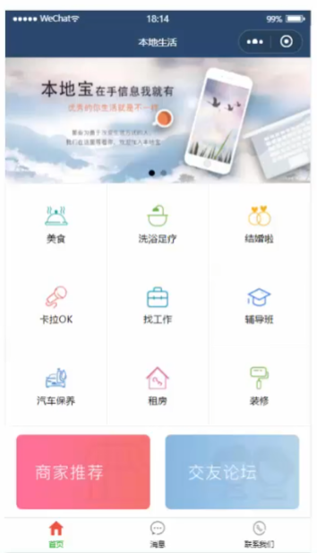

### 2.实现步骤

#### ①新建项目并梳理项目结构

创建三个页面：首页、消息、联系我们

```json
{
    "pages":[
        "pages/home/home",
        "pages/message/message",
        "pages/contact/contact"
    ]
}
```


#### ②配置<span style="color:red;">导航栏</span>效果

```json
{
    "window":{
        "backgroundTextStyle":"light",
        "navigationBarBackgroundColor": "#144a74",
        "navigationBarTitleText": "本地生活",
        "navigationBarTextStyle":"white"
    }
}
```


#### ③配置<span style="color:red;">tabBar</span>效果

```json
{
    "tabBar": {
        "list": [
            {
                "text": "首页",
                "pagePath": "pages/home/home",
                "iconPath": "images/home.png",
                "selectedIconPath": "images/home-active.png"
            },
            {
                "text": "消息",
                "pagePath": "pages/message/message",
                "iconPath": "images/message.png",
                "selectedIconPath": "images/message-active.png"
            },
            {
                "text": "联系我们",
                "pagePath": "pages/contact/contact",
                "iconPath": "images/contact.png",
                "selectedIconPath": "images/contact-active.png"
            }
        ]
    }
}
```


#### ④配置<span style="color:red;">轮播图</span>效果

接口地址：

- 获取<span style="color:red;">轮播图</span>数据列表的接口
    - [GET]  https://www.escook.cn/slides


`home.js`：编写发送数据请求的方法，并在onLoad生命周期函数中调用

```js
    /**
     * 页面的初始数据
     */
    data: {
        // 轮播图数据列表
        swiperList: []
    },

    // 获取轮播图数据的方法
    getSwiperList() {
        // wx.request({
        //   url: 'https://www.escook.cn/slides',
        //   method: 'GET',
        //   success: res => {
        //       console.log(res);
        //       this.setData({
        //           swiperList: res.data
        //       })
        //   }
        // })

        // 接口失效，编写模拟数据
        this.setData({
            swiperList: [{
                id: 1,
                image: 'https://i0.hdslb.com/bfs/archive/ac954fb2d28e52e1f38d7041d73d75155c49858d.jpg@672w_378h_1c_!web-home-common-cover.avif',
                link: ''
            }, {
                id: 2,
                image: 'https://i0.hdslb.com/bfs/archive/185a2a6f0e6b0b007595a6ef4a7b294b11a8aac9.jpg@672w_378h_1c_!web-home-common-cover.avif',
                link: ''
            }, {
                id:3,
                image: 'https://i1.hdslb.com/bfs/archive/1fe262be94e347f970587bfdc8a26d2154487c4a.jpg@672w_378h_1c_!web-home-common-cover.avif',
                link: ''
            }]
        })
    },

    /**
     * 生命周期函数--监听页面加载
     */
    onLoad(options) {
        this.getSwiperList()
    },
```

`home.wxml`：渲染轮播图数据

```xml
<!-- 轮播图区域 -->
<swiper circular indicator-dots>
    <swiper-item wx:for="{{swiperList}}" wx:key="id">
    <image src="{{item.image}}"/>
    </swiper-item>
</swiper>
```

`home.wxss`：编写轮播图样式

```css
swiper {
    height: 350rpx;
}

swiper image {
    width: 100%;
    height: 100%;
}
```


#### ⑤配置<span style="color:red;">九宫格</span>效果

`home.js`：编写发送数据请求的方法，并在onLoad生命周期函数中调用

```js
	/**
     * 页面的初始数据
     */
    data: {
        // 九宫格数据列表
        gridList: [],
    },

    // 获取九宫格数据的方法
    getGridList() {
        // wx.request({
        //     url: 'https://www.escook.cn/categories',
        //     method: 'GET',
        //     success: res => {
        //         console.log(res)
        //         this.setData({
        //             gridList: res.data
        //         })
        //     }
        // })

        // 接口失效，编写模拟数据
        this.setData({
            gridList: [{
                id: 1,
                name: '美食',
                icon: '/images/food.png',
            },{
                id: 2,
                name: '洗浴足疗',
                icon: '/images/bathtub.png',
            },{
                id: 3,
                name: '结婚啦',
                icon: '/images/diamond-ring.png',
            },{
                id: 4,
                name: '卡拉OK',
                icon: '/images/microphone.png',
            },{
                id: 5,
                name: '找工作',
                icon: '/images/handbag.png',
            },{
                id: 6,
                name: '辅导班',
                icon: '/images/education.png',
            },{
                id: 7,
                name: '汽车保养',
                icon: '/images/car.png',
            },{
                id: 8,
                name: '租房',
                icon: '/images/house.png',
            },{
                id: 9,
                name: '装修',
                icon: '/images/decoration.png',
            }]
        })
    },

    /**
     * 生命周期函数--监听页面加载
     */
    onLoad(options) {
        this.getGridList()
    },
```

`home.wxml`：渲染九宫格数据

```xml
<!-- 九宫格区域 -->
<view class="grid-list">
    <view class="grid-item" wx:for="{{gridList}}" wx:key="id">
        <image src="{{item.icon}}" />
        <text>{{item.name}}</text>
    </view>
</view>
```

`home.wxss`：编写九宫格样式

```css
.grid-list {
    display: flex;
    flex-wrap: wrap;
    border-top: 1px solid #efefef;
    border-left: 1px solid #efefef;
}

.grid-item {
    width: 33.33%;
    height: 200rpx;
    display: flex;
    flex-direction: column;
    align-items: center;
    justify-content: center;
    border-right: 1rpx solid #efefef;
    border-bottom: 1rpx solid #efefef;
    box-sizing: border-box;
}

.grid-item image {
    width: 60rpx;
    height: 60rpx;
}

.grid-item text {
    font-size: 24rpx;
    margin-top: 10rpx;
}
```


#### ⑥实现<span style="color:red;">图片布局</span>

`home.wxml`

```xml
<!-- 图片区域 -->
<view class="img-box">
    <image src="https://i2.hdslb.com/bfs/archive/8750ccedec917d1eb3a45ed2e6115e548c8f68e7.png@672w_378h_1c_!web-home-common-cover.avif" mode="widthFix"/>
    <image src="https://i1.hdslb.com/bfs/archive/6f2dd642914fd9e9af059f07078d5e3f5ec172d9.jpg@672w_378h_1c_!web-home-common-cover.avif" mode="widthFix"/>
</view>
```

`home.wxss`

```css
.img-box {
    display: flex;
    padding: 20rpx 10rpx;
    justify-content: space-around;
}

.img-box image {
    width: 45%;
    border-radius: 5px;
}
```


## 页面导航

### 1.什么是页面导航

页面导航指的是<span style="color:red;">页面之间的相互跳转</span>。例如：浏览器中实现页面导航的方式有如下两种：

①\<a>链接

②location.href


### 2.小程序中实现页面导航的两种方式：

#### ①<span style="color:red;">声明式导航</span>

- 在页面上声明一个\<navigator>导航组件
- 通过点击\<navigator>组件实现页面跳转


##### 1.导航到tabBar页面

<span style="color:red;">tabBar页面</span>指的是被配置为tabBar的页面。

在使用\<navigator>组件跳转到指定的tabBar页面时，需要指定<span style="color:red;">url</span>属性和<span style="color:red;">open-type</span>属性，其中：

- url表示要跳转的<span style="color:red;">页面的地址</span>，必须以<span style="color:red;">**/**</span>开头
- open-type表示<span style="color:red;">跳转的方式</span>，必须为 <span style="color:red;">switchTab</span>

```xml
<navigator url="/pages/message/message" open-type="switchTab">导航到消息页面</navigator>
```


##### 2.导航到非tabBar页面

<span style="color:red;">非tabBar页面</span>指的是没有被配置为tabBar的页面。

在使用\<navigator>组件跳转到普通的非tabBar页面时，需要指定<span style="color:red;">url</span>属性和<span style="color:red;">open-type</span>属性，其中：

- url表示要跳转的<span style="color:red;">页面的地址</span>，必须以<span style="color:red;">**/**</span>开头
- open-type表示<span style="color:red;">跳转的方式</span>，必须为 <span style="color:red;">navigate</span>

```xml
<navigator url="/pages/info/info" open-type="navigate">导航到info页面</navigator>
```

==注意：为了简便，在导航到非tabBar页面时，<span style="color:red;">open-type="navigate"</span>属性<span style="color:red;">可以省略</span>。==


##### 3.后退导航

如果要后退到上一页面或多级页面，则需要指定<span style="color:red;">open-type</span>属性和<span style="color:red;">delta</span>属性，其中：

- <span style="color:red;">open-type</span>的值必须是 <span style="color:red;">navigateBack</span>，表示要进行后退导航
- <span style="color:red;">delta</span>的值必须是<span style="color:red;">数字</span>，表示要后退的层级

```xml
<navigator open-type="navigateBack" delta="1">返回上一页</navigator>
```

==注意：为了简便，如果只是后退到上一页面，则<span style="color:red;">可以省略delta属性</span>，因为其<span style="color:red;">默认值就是 1</span>。==


#### ②<span style="color:red;">编程式导航</span>

- 调用小程序的导航API，实现页面的跳转


##### 1.导航到tabBar页面

调用 <span style="color:red;">wx.switchTab(Object object)</span> 方法，可以跳转到 tabBar 页面。其中 Object <span style="color:red;">参数对象</span>的属性列表如下：

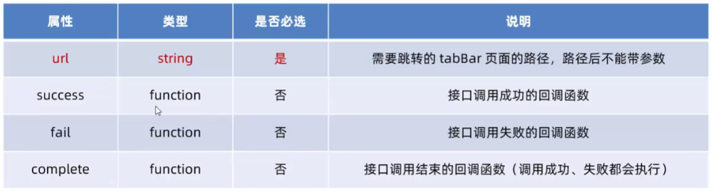

编写页面跳转函数

```js
// 通过编程式导航，跳转到message页面
gotoMessage() {
    wx.switchTab({
        url: '/pages/message/message'
    })
}
```

绑定页面跳转函数

```xml
<button bind:tap="gotoMessage">跳转到消息页面</button>
```


##### 2.导航到非tabBar页面

调用 <span style="color:red;">wx.navigateTo(Object object)</span> 方法，可以跳转到非 tabBar 页面。其中 Object  <span style="color:red;">参数对象</span>的属性列表如下：

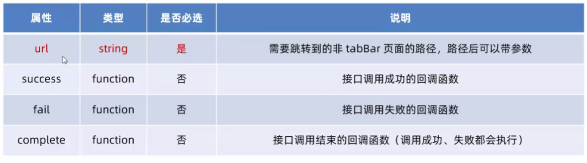

编写页面跳转函数

```js
// 通过编程式导航跳转到非 tabBar 页面
gotoInfo() {
    wx.navigateTo({
        url: '/pages/info/info',
    })
},
```

绑定页面跳转函数

```xml
<button bind:tap="gotoInfo">跳转到info页面</button>
```


##### 3.后退导航

调用 <span style="color:red;">wx.navigateBack(Object object)</span> 方法，可以返回上一页面或多级页面。其中 Object <span style="color:red;">参数对象</span>可选的属性列表如下：

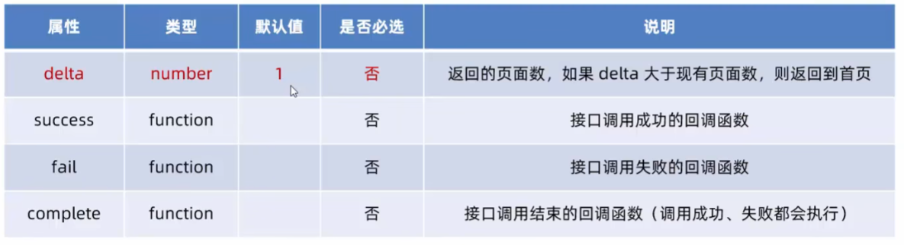

编写页面跳转函数

```js
// 通过编程式导航实现 后退 效果
goBack() {
    wx.navigateBack({
        delta: 1
    })
},
```

绑定页面跳转函数

```xml
<button bind:tap="goBack">后退</button>
```


### 3.导航传参

#### ①声明式导航传参

navigator组件的url属性用来指定要跳转的页面的路径。同时，路径的后面还可以携带参数：

- <span style="color:red;">参数</span>与<span style="color:red;">路径</span>之间使用 <span style="color:red;">**?**</span> 分隔
- <span style="color:red;">参数键</span>与<span style="color:red;">参数值</span>用 <span style="color:red;">**=**</span> 相连
- <span style="color:red;">不同参数</span>用 <span style="color:red;">**&**</span> 分隔

```xml
<navigator url="/pages/info/info?name=zs&age=20">跳转到Info页面</navigator>
```


#### ②编程式导航传参

调用 <span style="color:red;">wx.navigateTo(Object object)</span> 方法跳转页面时，也可以携带参数

```js
// 通过编程式导航跳转到非 tabBar 页面时携带参数
gotoInfo() {
    wx.navigateTo({
        url: '/pages/info/info?name=ls&gender=男',
    })
},
```


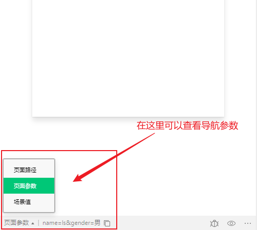


#### ③在onLoad中接收导航参数

通过<span style="color:red;">声明式导航传参</span>或<span style="color:red;">编程式导航传参</span>所携带的参数，可以直接在 <span style="color:red;">onLoad 事件</span>中直接获取到

```js
    /**
     * 生命周期函数--监听页面加载
     */
    onLoad(options) {
        // options 就是导航传递过来的参数对象
        console.log('tags', options);
    },
```


在info页面接收导航参数并在页面上显示

```js
    /**
     * 页面的初始数据
     */
    data: {
        // 导航传递过来的参数对象
        query: {}
    },

    /**
     * 生命周期函数--监听页面加载
     */
    onLoad(options) {
        // options 就是导航传递过来的参数对象
        console.log('tags', options);
        this.setData({
            query: options
        })
    },
```


```xml
<text>姓名：{{query.name}}</text>
```


## 页面事件

### 1.下拉刷新

<span style="color:red;">下拉刷新</span>是移动端的专有名词，指的是通过手指在屏幕上的下拉滑动操作，从而<span style="color:red;">**重新加载页面数据**</span>的行为。

#### 启用下拉刷新

##### ①<span style="color:red;">全局开启下拉刷新</span>

在 app.json 的 window 节点中，将 enablePullDownRefresh 设置为 true


##### ②<span style="color:red;">局部开启下拉刷新</span>（常用）

在页面的 .json 配置文件中，将 enablePullDownRefresh 设置为 true


#### 配置下拉刷新窗口的样式

在全局或页面的json配置文件中，通过 <span style="color:red;">backgroundColor</span> 和 <span style="color:red;">backgroundTextStyle</span> 来配置下拉刷新窗口的样式，其中

- <span style="color:red;">backgroundColor</span> 用来配置下拉刷新<span style="color:red;">窗口的背景颜色</span>，仅支持16进制的颜色值
- <span style="color:red;">backgroundTextStyle</span> 用来配置下拉刷新 <span style="color:red;">loading 的样式</span>，仅支持 dark 和 light


#### 监听页面的下拉刷新事件

在页面的 js 文件中，通过 <span style="color:red;">onPullDownRefresh()</span> 函数即可监听当前页面的下拉刷新事件


通过下拉刷新事件重置页面中的计数器

```xml
<view>count值是：{{count}}</view>

<button bind:tap="addCount">计数按钮</button>
```


```js
    /**
     * 页面的初始数据
     */
    data: {
        count: 0
    },

    // 计数按钮的点击事件
    addCount() {
        this.setData({
            count: this.data.count + 1
        })
    },

    /**
     * 页面相关事件处理函数--监听用户下拉动作
     */
    onPullDownRefresh() {
        console.log('触发了message页面的下拉刷新');
        this.setData({
            count: 0
        })
    },
```


#### 停止下拉刷新的效果

当处理完下拉刷新后，下拉刷新的 loading 效果会一直显示，<span style="color:red;">不会主动消失</span>，所以需要手动停止。

此时，调用 <span style="color:red;">wx.stopPullDownRefresh()</span> 可以停止当前页面的下拉刷新。

```js
    /**
     * 页面相关事件处理函数--监听用户下拉动作
     */
    onPullDownRefresh() {
        console.log('触发了message页面的下拉刷新');
        this.setData({
            count: 0
        })
        
        // 停止下拉刷新的动画效果
        wx.stopPullDownRefresh()
    },
```


### 2.上拉触底

<span style="color:red;">上拉触底</span>是移动端的专有名词，通过手指在屏幕上的上拉滑动操作，从而<span style="color:red;">**加载更多数据**</span>的行为。


#### 监听页面的上拉触底事件

在页面的 js 文件中，通过 <span style="color:red;">onReachBottom()</span> 函数接口监听当前页面的上拉触底事件


#### 配置上拉触底的距离

上拉触底距离指的是<span style="color:red;">触发上拉触底事件时，滚动条距离页面底部的距离</span>。

可以在全局或页面的 json 配置文件中，通过 <span style="color:red;">onReachBottomDistance</span> 属性来配置上拉触底的距离。

小程序的默认触底距离是 50 px，在实际开发中，可以根据自己的需求修改这个默认值。


#### 案例

**实现步骤：**

①定义获取随机颜色的方法

```js
data: {
    // 随机颜色的列表
    colorList: []
},
    
getColors() {
    wx.request({
        url: 'https://www.escook.cn/api/color',
        method: 'GET',
        success: ({ data: res }) => {
            this.setData({
                colorList: [...this.data.colorList, ...res.data]
            })
        }
    })
},
```


②在页面加载时获取初始数据

```js
    /**
     * 生命周期函数--监听页面加载
     */
    onLoad(options) {
        this.getColors()
    },
```


③渲染UI结构并美化页面效果

```xml
<view wx:for="{{colorList}}" wx:key="index" class="num-item" style="background-color: {{item}};">{{item}}</view>
```


```css
.num-item {
    border: 1rpx solid #efefef;
    border-radius: 8rpx;
    line-height: 200rpx;
    margin: 15rpx;
    text-align: center;
    text-shadow: 0rpx, 0rpx, 5rpx #fff;
    box-shadow: 1rpx 1rpx 6rpx #aaa;
}
```


<span style="color:red;">④在上拉触底时调用获取随机颜色的方法</span>

```js
    /**
     * 页面上拉触底事件的处理函数
     */
    onReachBottom() {
        this.getColors()
    },
```


<span style="color:red;">⑤添加 loading 提示效果</span>

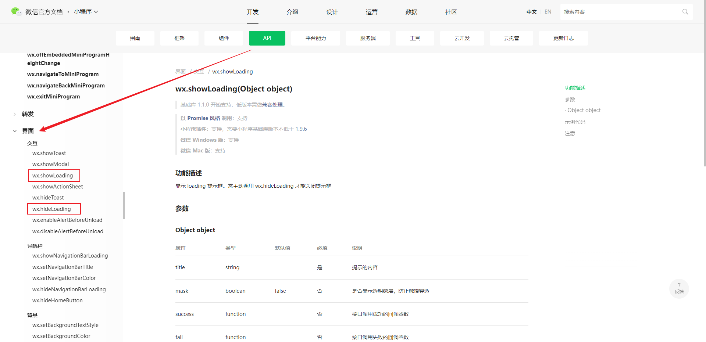

```js
    getColors() {
        // 显示 loading 提示框
        wx.showLoading({
            title: '加载中...'
        })
        wx.request({
            //   url: 'https://www.escook.cn/api/color',
            url: 'https://api.toolkk.com/api/color/random',
            //   method: 'GET',
            method: 'POST',
            data: {
                num: 10
            },
            success: ({ data: res }) => {
                console.log('tags', res.data);
                this.setData({
                    colorList: [...this.data.colorList, ...res.data]
                })
            },
            complete: () => {
                // 关闭 loading 提示框
                setTimeout(() => {
                    wx.hideLoading()
                }, 500)
            }
        })
    },
```


<span style="color:red;">⑥对上拉触底进行节流处理</span>

==目的：为了防止在短时间内触发多次上拉触底函数，进而发送多个请求==

- <span style="color:red;">在 data 中**定义** isLoading 节流阀</span>
- <span style="color:red;">在 getColors() 方法中**修改** isLoading 节流阀的值</span>
- <span style="color:red;">在 onReachBottom 中**判断**节流阀的值，从而对数据请求进行节流控制</span>

```js
    /**
     * 页面的初始数据
     */
    data: {
        colorList: [],
        // 设置节流阀
        isLoading: false
    },

    getColors() {
        // 开启节流阀
        this.setData({
            isLoading: true
        })
        // 显示 loading 提示框
        wx.showLoading({
            title: '加载中...'
        })
        wx.request({
            //   url: 'https://www.escook.cn/api/color',
            url: 'https://api.toolkk.com/api/color/random',
            //   method: 'GET',
            method: 'POST',
            data: {
                num: 10
            },
            success: ({ data: res }) => {
                console.log('tags', res.data);
                this.setData({
                    colorList: [...this.data.colorList, ...res.data]
                })
            },
            complete: () => {
                setTimeout(() => {
                    // 关闭 loading 提示框
                    wx.hideLoading()
                    // 关闭节流阀
                    this.setData({
                        isLoading: false
                    })
                }, 500)
            }
        })
    },

    /**
     * 页面上拉触底事件的处理函数
     */
    onReachBottom() {
        if (!this.data.isLoading) {
            this.getColors()
        }
    },
```


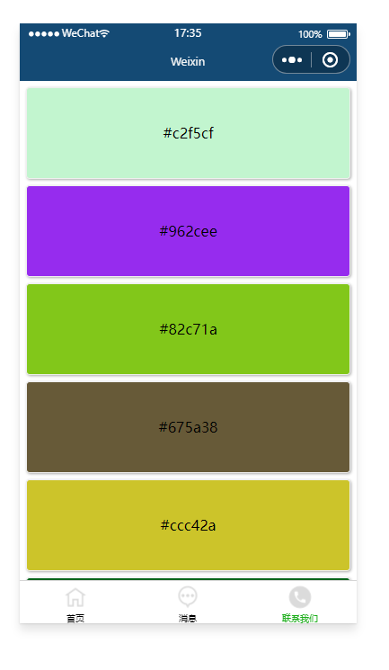


## 扩展：自定义编译模式

通过自定义编译模式，可以指定下次重新编译时的启动页面，从而提高开发效率

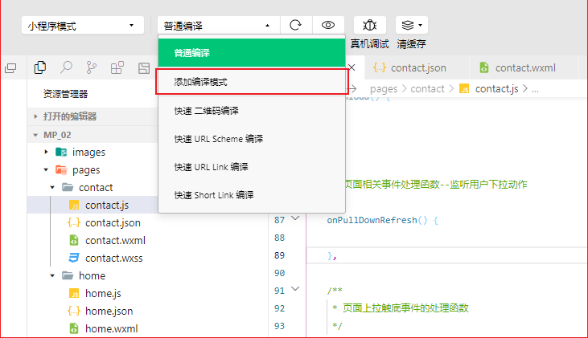


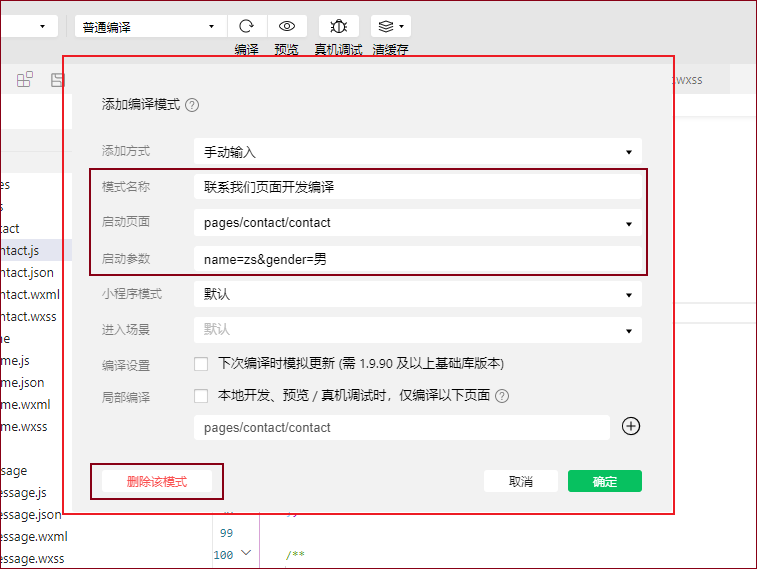


## 生命周期

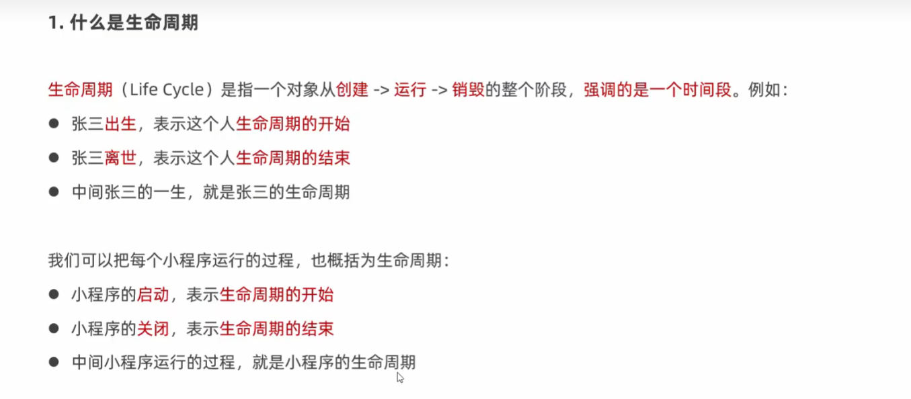

### 分类

#### 应用生命周期

特指小程序从启动 --> 运行 --> 销毁的过程


#### 页面生命周期

特指小程序中，每个页面的加载 --> 渲染 --> 销毁的过程


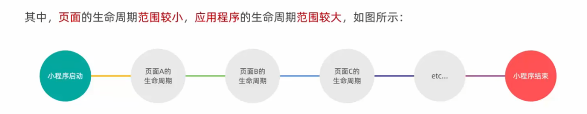


### 生命周期函数

<span style="color:red;">生命周期函数</span>：是由小程序提供的<span style="color:red;">内置函数</span>，会伴随着声明周期，<span style="color:red;">自动按顺序执行</span>。

<span style="color:red;">生命周期函数的作用</span>：运行程序员<span style="color:red;">在特定的时间点</span>，<span style="color:red;">执行某些特定的操作</span>。例如：页面刚加载的时候，可以在 onLoad 生命周期函数中初始化页面的数据。


注意：<span style="color:red;">生命周期</span>强调的是<span style="color:red;">时间段</span>，<span style="color:red;">生命周期函数</span>强调的是<span style="color:red;">时间点</span>。

 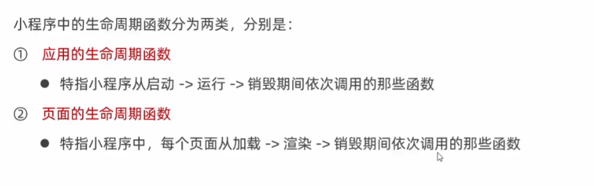

#### 应用的生命周期函数

小程序的<span style="color:red;">应用生命周期函数</span>需要在 <span style="color:red;">app.js</span> 中进行声明

```js
// app.js
App({
    // 小程序初始化完成时，执行此函数，全局只触发一次。可以做一些初始化的工作
    onLaunch: function (options) {},
    // 小程序启动，或从后台进入前台显示时触发
    onShow: function (options) {},
    // 小程序从前台进入后台时触发
    onHide: function () {}
})
```


#### 页面的生命周期函数

小程序的<span style="color:red;">页面生命周期函数</span>需要在页面的 <span style="color:red;">.js 文件</span>中进行声明

```js
Page({
    onLoad: function(options) {}, 	//监听页面加载，一个页面只调用1次
    onShow: function() {}, 			//监听页面显示
    onReady: function() {}, 		//监听页面初次渲染完成，一个页面只调用1次
    onHide: function() {},			//监听页面隐藏
    onUnload: function() {}			//监听页面卸载，一个页面只调用1次
})
```


## WXS脚本

<span style="color:red;">WXS</span>（WeiXin Script）是<span style="color:red;">小程序独有的一套脚本语言</span>，结合WXML，可以构建出页面的结构。


应用场景：<span style="color:red;">wxml 中无法调用在页面的 .js 中定义的函数</span>，但是，wxml 中可以调用wxs中定义的函数。因此，小程序中wxs的<span style="color:red;">典型应用场景</span>就是“<span style="color:red;">过滤器</span>”。


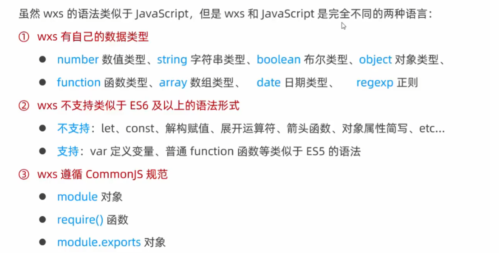


### 基础语法

#### 1.内嵌wxs脚本

wxs 代码可以编写在 wxml 文件中的 <span style="color:red;">\<wxs></span> 标签内，就像 Javascript 代码可以编写在 html 文件中的 \<script> 标签内一样。

wxml 文件中的每个 \<wxs>\</wxs> 标签，<span style="color:red;">必须提供 module 属性</span>，用来指定<span style="color:red;">当前 wxs 的模块名称</span>，方便在 wxml 中访问模块中的成员。

`message.wxml`

```xml
<view>{{m1.toUpper(username)}}</view>

<wxs module="m1">
	// 将文本转为大写形式
    module.exports.toUpper = function(str) => {
    	return str.toUppperCase();
    }
</wxs>
```

在 data 中定义 username

```js
Pages({
    data: {
        username: 'zhangsan'
    }
})
```


#### 2.外联wxs脚本

wxs 代码还可以编写在<span style="color:red;">以 .wxs 为后缀名的文件内</span>，就像 javascript 代码可以编写在以 .js 为后缀名的文件中一样。

定义`tools.wxs`

```js
// tools.wxs 文件
function toLower(str) {
    return str.toLowerCase()
}

module.exports = {
    toLower
}
```

在 wxml 中引入外联的 wxs 脚本时，<span style="color:red;">必须</span>为 \<wxs> 标签添加 <span style="color:red;">module</span> 和 <span style="color:red;">src</span> 属性，其中：

- <span style="color:red;">module</span> 用来指定模块的的名称
- <span style="color:red;">src</span> 用来指定要引入的脚本的路径，且<span style="color:red;">必须是相对路径</span>

`message.wxml`

```xml
<!-- 调用 m2 模块中的方法 -->
<view>{{m2.toLower(country)}}</view>

<!-- 引用外联的 tools.wxs 脚本，并命名为 m2 -->
<wxs module="m2" src="../../utils/tools.wxs"></wxs>
```

在 data 中定义 country

```js
Pages({
    data: {
        country: 'CHINA'
    }
})
```


#### 3.wxs的特点

**1.与 javascript 不同**

​	为了降低 wxs 的学习成本，wxs 语言在设计时大量借鉴了 javascript 的语法。但本质上，它们是完全不同的两种语言！


**2.不能作为组件的事件回调**

​	wxs 典型的应用场景就是“<span style="color:red;">过滤器</span>”，<span style="color:red;">经常配合 Mustache 语法进行使用</span>

```xml
<view>{{m2.toLower(country)}}</view>
```

​	但是，在 wxs 中定义的函数<span style="color:red;">不能作为组件的事件回调函数</span>，如下用法是==错误的==

```xml
<button bind:tap="m2.toLower(country)">按钮</button>
```


**3.隔离性**

wxs 的运行环境和其他 javascript 代码是隔离的，体现在如下两个方面：

① wxs 不能调用 js 中定义的函数

② wxs 不能调用小程序提供的 API


**4.性能好**

- 在 <span style="color:red;">iOS 设备</span>上，小程序内的 <span style="color:red;">wxs</span> 会比 javascript 代码<span style="color:red;">快 2 ~ 20 倍</span>

- 在 <span style="color:red;">Android 设备</span>上，二者的运行效率<span style="color:red;">无差异</span>


## 案例-本地生活（列表页面）

### 1.页面效果

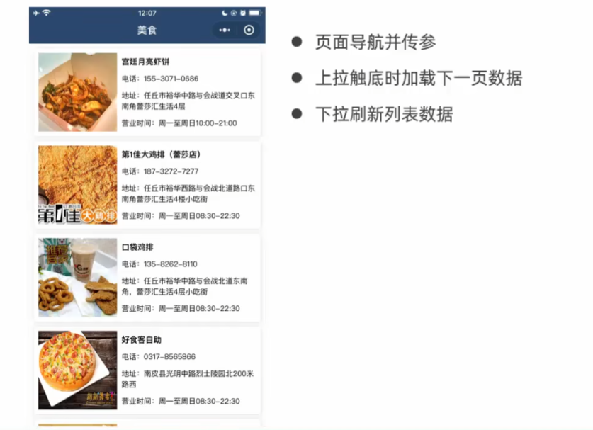

### 2.实现步骤

#### ①创建列表页面

`app.json`

```json
{
    "pages": [
        "pages/home/home",
        "pages/message/message",
        "pages/contact/contact",
        "pages/shoplist/shoplist"
    ]
}
```


#### ②改造首页

`home.wxml`

```xml
<!-- 九宫格区域 -->
<view class="grid-list">
    <navigator class="grid-item" wx:for="{{gridList}}" wx:key="id"
               url="/pages/shoplist/shoplist?id={{item.id}}&title={{item.name}}">
        <image src="{{item.icon}}" />
        <text>{{item.name}}</text>
    </navigator>
</view>
```


#### ③实现页面动态标题

[参考官方文档](https://developers.weixin.qq.com/miniprogram/dev/api/ui/navigation-bar/wx.setNavigationBarTitle.html)可知：可以调用`wx.setNavigationBarTitle`方法来动态设置当前页面的标题

[wx.setNavigationBarTitle方法的调用时机](https://developers.weixin.qq.com/miniprogram/dev/reference/api/Page.html)

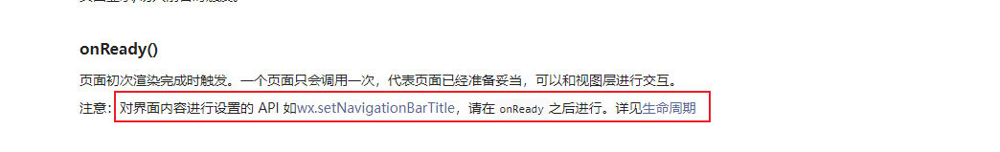

```js
Page({

    /**
     * 页面的初始数据
     */
    data: {
        // 用来接收并共享导航传参
        query: {}
    },

    /**
     * 生命周期函数--监听页面加载
     */
    onLoad(options) {
        // 将导航传参存储到data中
        this.setData({
            query: options
        })
    },

    /**
     * 生命周期函数--监听页面初次渲染完成
     */
    onReady() {
        // 动态设置导航标题
        wx.setNavigationBarTitle({
            title: this.data.query.title,
          })
    },
    
    ...
}
```


